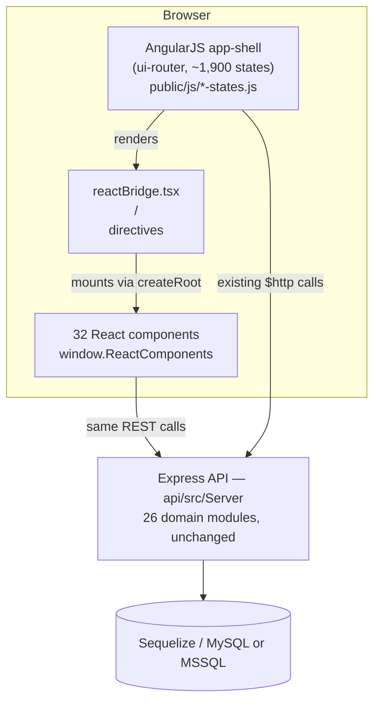

# HIMS Angular → React Migration — Project Audit

**Scope:** Phase 1 audit only, per your instructions. No code was changed while producing this document. This report is the foundation for the migration map, module inventory, and phased plan you asked for before any migration work begins.

**Companion file:** `docs/migration_screen_inventory.csv` — 1,906 legacy AngularJS `ui-router` states extracted programmatically from the production state-definition files, with route and controller for each.

---

## 1. Executive summary — read this first

This is **not** a from-scratch Angular-to-React migration. It is a large, mature production HIMS (Hospital Information Management System) that is already **partway through an incremental migration**, using a working, documented pattern:

- The legacy frontend is **AngularJS 1.x** (not Angular 2+) — a ~2,600-template, ~1,900-route single-page app served from `public/`.
- The backend is a separate **Node.js/Express/TypeScript/Sequelize** service in `api/`, organized into 26 business-domain modules, and this backend is **shared** — both the legacy AngularJS screens and the new React components call the same existing REST API. Nothing needs to change here for the frontend migration to work.
- A **React 19 + Vite 8** frontend already exists at the repo root (`src/`), and 32 components are already live in production, mounted **inside** the AngularJS pages via a custom bridge directive (`<react-component>`), not as a separate app. There's a written playbook for this (`REACT_MIGRATION_GUIDE.md`) and a changelog of real fixes made while doing it (`migration_fixes_log.md`, dated May 2–3, 2026).

**Recommendation, addressed directly: continue the established bridge pattern, module by module. Do not restart as a greenfield React rewrite.** The existing approach already satisfies your top requirements — zero API changes, incremental verification, old and new UI coexisting safely — and abandoning it to "build a new React app" would throw away working, tested integration code and re-introduce exactly the regression risk you're trying to avoid.

The remaining work is large: roughly **97–99% of legacy screens** (by state count) still run on AngularJS. This audit quantifies that gap, maps the module boundaries, and flags the risks that need attention before or during migration. It does not attempt to enumerate all ~1,900 screens' business logic line-by-line — that isn't practical or useful as a static document; instead it gives you an accurate inventory (attached CSV), the structural map, and a recommended sequencing.

---

## 2. Stack identification

| Layer | Technology | Version | Location |
|---|---|---|---|
| Legacy frontend | AngularJS (1.x, `ui-router`, `ng-include` partials) | bundled, pre-npm era | `public/` (served statically; `dist/` is its build copy) |
| New frontend | React + Vite | React 19.2.5, Vite 8.0.10, TypeScript ~6.0 | `src/` (repo root) |
| Bridge layer | Custom AngularJS directive + `window.ReactComponents` registry | — | `src/reactBridge.tsx`, `src/main.tsx` |
| Backend API | Node.js / Express 5-alpha / TypeScript 4.9, built with Gulp | `gloomsoft.api` v2.0.391 | `api/` (npm workspace) |
| ORM / DB | Sequelize v4, dialect set via env (`mysql2` and `tedious`/mssql both present as deps — multi-dialect deployment) | — | `api/src/config/DbConfig.ts` |
| Auth | Passport.js: `bearer` strategy globally, `local` strategy scoped to `/Auth`; Redis-backed `express-session` | — | `api/src/Server/Router.ts`, `Core/Middleware/Auth.ts` |
| Build orchestration | npm workspaces (root `package.json` → `workspaces: ["api"]`), root builds React via `tsc -b && vite build`, API via Gulp | — | root `package.json`, `api/package.json` |
| CI | SonarQube scan only | — | `.github/workflows/sonarqube.yml` |

Root TypeScript (6.x, for React) and API TypeScript (4.9, for the Gulp backend) are **deliberately kept separate** via npm workspaces — this was a considered decision made during the migration (documented in `migration_fixes_log.md`, "Consolidating Package Management," May 2, 2026) specifically to avoid a TS-version conflict. Don't merge these package.json files.

---

## 3. Architecture — how old and new currently coexist

The pattern, as documented in `REACT_MIGRATION_GUIDE.md`:

1. An AngularJS controller is "hollowed out" — its API calls, `$watch`es and DOM logic are stripped, leaving it as a thin proxy that gathers `$state`, session, and privilege data into a `$scope.reactProps` object.
2. The legacy `.html` template is replaced with a single `<react-component name="X" props="...">` tag.
3. A new `.tsx` file is added to `src/react-components/`, written against the `reactProps` contract, and registered in `src/main.tsx`'s `window.ReactComponents` map.
4. AngularJS keeps owning routing (`ui-router`), session/auth, and privilege evaluation; React owns rendering and local UI state.

This means, importantly for your zero-regression requirement: **the API contract is never touched by this migration** — React components call the same backend through the same endpoints the AngularJS controllers already used (confirmed directly in `src/services/apiService.ts` and the component code, e.g. `PrintControl.tsx`, `OPBillingSaveBar.tsx`).

**Proof this pattern works at scale:** per the fix log, migrating the shared `printcontrol` directive to React (`PrintControl.tsx`) instantly modernized print behavior across **44 legacy template files** with zero changes to those templates' HTML beyond the tag swap — this is the leverage point of the bridge approach: shared widgets migrate once and propagate everywhere they're used.

---

## 4. Quantitative inventory

### 4.1 Legacy AngularJS frontend (`public/`)

| Metric | Count |
|---|---|
| HTML templates | 2,630 |
| Controller/view JS files | 2,629 |
| Top-level domain folders under `public/views/` | 32 |
| `ui-router` states (screens/sub-views), extracted | **1,906** |
| — of which have a resolvable route + controller | 1,899 controllers, 1,906 URLs (100%) |

State namespaces (top-level state prefix):

| Namespace | States | What it is |
|---|---|---|
| `app.*` | 1,562 | Main HIMS shell — the bulk of clinical/admin/billing screens |
| `patientemr.*` | 178 | Clinical EMR record viewer |
| `patientportal.*` | 112 | Patient-facing self-service portal |
| `surgeryentry.*` | 41 | OT/surgery entry flow |
| `self.*` | 8 | Login/signup/OTP flows |
| `page.*` / `pages.*` | ~4 | Standalone pages |

Domain folders under `public/views/`: `inpatient, linenandlaundry, pharmacy, billmodifications, emr, tallyreport, patientportal, lis, successstory, patientsignup, assetmanagement, financereports, qualitymanagement, hrms, dashboard, tally, common, inventory, qms, incidentmanagement, taskmanagement, patientservices, partials, equipmentmaster, medicineorder, billing, banner, virtualservices, reports, cssd, message, mock`.

The full state → URL → controller list is in **`migration_screen_inventory.csv`** (1,906 rows). Note: `templateUrl` extraction was largely unsuccessful via static parsing because most states declare templates through a nested `views: {...}` object rather than a flat `templateUrl` key — resolving that mapping precisely will need either a small runtime introspection script (dump `$state.get()` from a running app) or a deeper AST-based parse; the state name, route, and controller (99.6% populated) are reliable as-is and are enough to drive a migration checklist.

### 4.2 Backend (`api/src/Server/Modules/`)

3,050 TypeScript files across 26 domain modules, each following a consistent `Business (Bo) / Model (+Interface) / Router / Service / Common` layering:

| Module | .ts files | Module | .ts files |
|---|---|---|---|
| EMR | 428 | LinenAndLaundry | 40 |
| Pharmacy | 402 | BillModification | 27 |
| ClinicalMaster | 377 | BillingMaster | 27 |
| Billing | 332 | DoctorInvoice | 27 |
| SystemSettings | 245 | General | 21 |
| LIS | 232 | AccidentEmergency | 17 |
| GeneralMaster | 206 | DischargeSummary | 17 |
| IPManagement | 130 | TaskManagement | 17 |
| Registration | 93 | NoUserCalls | 12 |
| AssetManagement | 90 | Base | 4 |
| VirtualHealthcare | 82 | API (shared base classes) | 2 |
| Visit | 63 | | |
| Appointment | 57 | | |
| OtManagement | 55 | | |
| CostManagement | 47 | | |

Each module is mounted at a matching base path in `api/src/Server/Router.ts` (`/Billing`, `/Pharmacy`, `/EMR`, `/IPManagement`, etc. — 26 mounts plus `/api`, `/SystemSettings`, `/Auth`, `/v2/app`). **This router file is the authoritative API contract** — every route mounted there is a promise React must keep calling exactly as-is.

Some individual business-logic files are very large and correspondingly high-risk to touch even indirectly: `Billing/Business/HimsPatientBillsBo.ts` (1.5 MB), `Billing/Business/HimsPatientPaymentDetailsBo.ts` (553 KB), `Billing/Business/HimsPatientBillDetailsBo.ts` (530 KB), `billing/opbilling/editbillingrequest.js` on the frontend (208 KB). Treat these as their own sub-projects when their turn comes, not as routine files.

### 4.3 React migration progress (`src/`)

| Metric | Count |
|---|---|
| React components live and wired into the bridge (`window.ReactComponents`) | 32 |
| Components built but **not yet wired in** | 1 (`RegCumVisitWithBillScreen.tsx`) |
| Shared design-system folders scaffolded (`src/components/{common,forms,layout,navigation,ui}`) | 5 folders, **all empty** |
| Legacy AngularJS states still unmigrated | ~1,874 of 1,906 (≈98%) |

**Already-migrated components** (dashboards, shared controls, and forms already proven in production):

`AdminDashboardComponent, BillingDashboardComponent, FrontOfficeDashboardComponent, LabDashboardComponent, NursingDashboardComponent, PharmacyDashboardComponent, DoctorDashboardTopSection, LoginPage, SidebarComponent, TopNavbarComponent, RegistrationActionBar, RegistrationFooter, RegistrationFormComponent, OPBillingActionBar, OPBillingSaveBar, PrintControl, PatientSearchControl, AgeDisplay, CityControl, PincodeControl, CountryControl, StateControl, DistrictControl, AreaControl, RichTextEditor, Button, ConfirmModal, BarcodeModal, BarcodeMasterSettingsComponent, FindBillModalComponent, PilotComponent`.

This gives you your **first concrete migration-status data point**: dashboards, top navigation/sidebar, login, registration action bars, OP billing action bars, and a set of shared address/geo controls are done. The 98% remaining is dominated by the deep transactional screens inside Billing, Pharmacy, EMR, ClinicalMaster, and LIS (the five largest backend modules above), which is exactly where the highest business-logic risk also concentrates.

---

## 5. Findings and risks

Ordered roughly by how much they matter to your zero-regression mandate.

**1. `tsc_errors.log` is stale — re-run the build before trusting any error count.**
The committed log (185 errors) references five component files (`PatientRegistrationMasterScreen.tsx`, `PharmacyPOSScreen.tsx`, `PurchaseOrderVendorScreen.tsx`, `RISRadiologyWorklistScreen.tsx`, `SystemSettingsMasterScreen.tsx`) that **do not exist** in `src/react-components/` today. Either they were removed/renamed after the log was generated, or the log is from a different working state. Don't use it as a current build-health signal — regenerate it (`npm run build` from repo root) before starting any module.

**2. Duplicate, drifted backend code: `src/Server/` vs `api/src/Server/`.**
A second copy of backend Common services (`ConferenceService.ts`, `IntegrationService.ts`, `Misc.ts`, `Request.ts`, `Response.ts`, and more) exists at the repo root under `src/Server/`, separate from the real backend at `api/src/Server/`. `diff` confirms these copies have **already diverged in content**. The npm workspace and every build/start script reference only `api/` as the backend, so `src/Server/` appears to be dead/orphaned — but its presence is a real hazard: someone (human or AI) could edit the wrong copy and silently produce no effect, or a future refactor could accidentally wire it in. **Confirm it's unused, then remove it deliberately — don't delete blind, and don't assume.**

**3. `DbConfig.ts` sets `force: true` in the Sequelize connection options.**
`api/src/config/DbConfig.ts` passes `force: true` inside `Options`. In Sequelize, `force: true` is the flag used on `sequelize.sync({ force: true })` to **drop and recreate tables**. This audit did not trace every place `Options`/`Repository.ts` consumes this value, so it is not confirmed to be destructive as configured — but given your explicit Section 9 requirement ("do not drop tables"), this needs a direct, deliberate check by someone who can read `Core/Repository.ts` against this config before any deploy, migration-related or not. Flagging this is the single highest-priority item in this audit.

**4. CORS is currently wide open.** `Router.ts` sets `Access-Control-Allow-Origin: '*'` globally. Not something the migration needs to change, but worth a conscious decision (keep as-is vs. tighten) rather than carrying it forward silently.

**5. No shared React design system exists yet, despite being scaffolded.** `src/components/{common,forms,layout,navigation,ui}` are empty directories. The one true shared primitive that exists (`Button.tsx`) lives directly under `react-components/`, not in `components/common/`. Section 12/20 of your brief asks for reusable `Input`, `Select`, `DataTable`, `Modal`, etc. — none of these exist yet. This should be one of the first things built (see §7), because every subsequent screen migration will otherwise reinvent it.

**6. `src/App.tsx` is still the unmodified Vite starter template** (demo counter, Vite/React logos). It is not part of the real application — the real integration point is `main.tsx` + `reactBridge.tsx`. Safe to delete or repurpose; flagging only so nobody mistakes it for a real entry point.

**7. No automated test coverage was found for either the legacy or new frontend.** The `api/` package still carries Karma/Protractor/Jasmine config from the AngularJS era, but there's no evidence in the scripts or CI that this suite currently runs. `.github/workflows/sonarqube.yml` is the only CI. For a "zero functionality break" mandate on a system this size, some form of automated regression coverage (even a thin E2E smoke suite over the highest-traffic screens — login, registration, OP billing, pharmacy dispense) is close to a prerequisite, not a nice-to-have.

**8. Process: everything lands directly on `main`, no branches/PRs visible in history.** Recent commits show real, good security remediation (hardcoded secrets removed, Firebase keys purged from git history, TLS validation enabled) — but also informal WIP messages ("changes made", "CHNGES DONE") committed straight to the branch that (per `api/package.json`'s `serve.prod` script) appears to be what ships. Worth a deliberate call on branch/PR discipline before 26 modules' worth of migration work lands here.

**9. Real patient documents live in the repository tree.** `api/ui/docs/` contains generated PDFs (discharge summaries, bills) named by patient/visit/bill identifiers — this is live output storage sitting inside the codebase, not synthetic test data. This audit only listed filenames and did not open any document. Worth confirming this directory is excluded from git and from any tooling context (including future AI-assisted sessions) that doesn't need it.

**10. Two dead/legacy copies of the state file remain in the bundle**: `hims-states_orig.js` (1.2 MB) and `hims-states_split_old.js` (1.0 MB) sit alongside the live `hims-states.js`. Confirm nothing references them, then remove — they add confusion and repo weight, not function.

---

## 6. Recommended migration approach

**Keep the bridge pattern. Don't restart.** Concretely:

- Every module migration follows the same four-step "hollow controller" recipe already documented in `REACT_MIGRATION_GUIDE.md`. Don't invent a second pattern.
- Migrate **shared widgets before whole screens** within each module — the `printcontrol` precedent (one component, 44 files updated for free) is the highest-leverage move available, and each module likely has 3–8 such shared directives/controls worth finding first.
- Build the missing shared design system (`src/components/{common,ui,forms}`) *before* or *alongside* the first full-screen migration in whichever module goes first — otherwise every screen migration re-solves "what does our Input/Select/Modal look like."
- Never delete an AngularJS controller/template until its React replacement has been verified against the checklist in §8 — this repo already treats replaced templates as "hollowed," not deleted-and-rebuilt, which is the right instinct; keep doing that.
- Because the frontend and backend are decoupled through a stable REST contract that neither side needs to change, module migrations can proceed **fully independently and in parallel** if you have more than one engineer — Billing's migration cannot break EMR's.

---

## 7. Phased plan, mapped to this codebase

Your brief's priority order (§34), reconciled against what actually exists here:

| Phase | Target | Why this order |
|---|---|---|
| 0 | **Verification prerequisites** — regenerate `tsc_errors.log`, confirm/resolve the `src/Server` duplication, confirm the `DbConfig.force` question, decide on branch/PR discipline | Findings #1–3, #8 above; doing module work on top of an unverified build or an unresolved DB-safety question compounds risk |
| 1 | **Shared design system** (`src/components/common`: Button — already exists but misplaced, Input, Select, SearchSelect, DatePicker, Checkbox, RadioGroup, Modal/Dialog, DataTable, Pagination, Toast, ConfirmationDialog — already exists, LoadingState, ErrorState, EmptyState) | Finding #5; every later screen depends on this existing first |
| 2 | **Auth / Login** — already migrated (`LoginPage.tsx`); verify it against current Passport/session behavior and close the loop | Matches §34 priority 1; mostly a verification pass, not new build |
| 3 | **Layout / Sidebar / Top nav** — already migrated (`SidebarComponent`, `TopNavbarComponent`); verify collapse/expand, permission-driven menu items, and active-state behavior against the legacy version | Matches §34 priorities 2–3 |
| 4 | **Master/reference data screens** — `GeneralMaster` (206 files) and `SystemSettings` (245 files) modules: facilities, roles, users, departments, tariffs, etc. | Matches §34 priority 7; these screens are read/write-simple CRUD grids, good next targets to prove out the new DataTable/Form components from Phase 1 |
| 5 | **Registration** (93 backend files; `RegistrationFormComponent`, `RegistrationActionBar`, `RegistrationFooter` already migrated) — complete the remaining registration screens | Matches §34 priority 8; furthest along already |
| 6 | **Appointment** (57 files) | Matches §34 priority 9 |
| 7 | **Billing** (332 files — largest single revenue-risk module; OP billing action/save bars already migrated) | Matches §34 priority 10; highest business-logic density (`HimsPatientBillsBo.ts` at 1.5 MB) — plan this as its own sub-project with dedicated QA, not a sprint task |
| 8 | **ClinicalMaster (377) + EMR (428)** | Matches §34 priority 11; largest module by file count, clinically sensitive — pair with clinicians for verification, not just engineers |
| 9 | **LIS (232, "Laboratory")** | Matches §34 priority 12; no separate Radiology module exists — radiology screens live inside LIS/ClinicalMaster/EMR, confirm exact ownership per screen during Phase 8–9 |
| 10 | **Pharmacy (402)** | Matches §34 priority 14; second-largest module, dashboard already migrated |
| 11 | **IPManagement (130), VirtualHealthcare (82), AccidentEmergency (17), OtManagement (55), DischargeSummary (17), DoctorInvoice (27), BillModification (27), BillingMaster (27), LinenAndLaundry (40), AssetManagement (90), CostManagement (47), TaskManagement (17), General (21)** | Remaining modules, roughly in ascending complexity; sequence within this group based on actual usage/traffic once you have that data |
| 12 | **Legacy AngularJS removal** — only after every module above is verified | Your §24 requirement: inventory → map → build → test → verify → *then* delete |

Note on scale: even at a sustained pace, ~1,900 states across modules this dense (some backend business-logic files alone exceed 500 KB) is realistically a multi-quarter program with a dedicated team, not something to compress. This audit's job was to make that scope visible and sequenced, not to promise a timeline.

---

## 8. Per-screen verification checklist (use for every migrated screen)

Same fields, checked against the AngularJS original before its template is hollowed:

Same route/URL and route/query parameters · same API endpoint(s) and payload shape · same required/validated fields and default values · same dropdown/master-data sources (no hardcoded values) · same conditional/enable-disable field logic · same save/update/delete/reset behavior · same permission/privilege checks (role, facility, user) · same search/filter/sort/pagination/export behavior · same success/warning/error messaging · same print/upload/download behavior where applicable.

Record PASS/FAIL per screen against this list before removing the AngularJS original, per your §30 requirement.

---

## 9. Immediate next steps (before writing any migration code)

1. Run `npm run build` fresh and get a current, trustworthy error baseline (Finding #1).
2. Get a direct answer on `DbConfig.ts`'s `force: true` (Finding #3) — this is the one item in this audit with actual data-safety stakes.
3. Decide the fate of `src/Server/` (Finding #2): confirm unused, then remove.
4. Confirm PHI-bearing paths (`api/ui/docs/` and similar) are excluded from git and from any AI tooling's working context (Finding #9).
5. Once 1–4 are resolved, start Phase 1 (shared design system) — everything downstream depends on it.

---

*This audit covers structure, scale, and architecture. It does not assert correctness of business logic inside any individual file — that verification happens screen-by-screen, per §8, as each module is migrated.*
